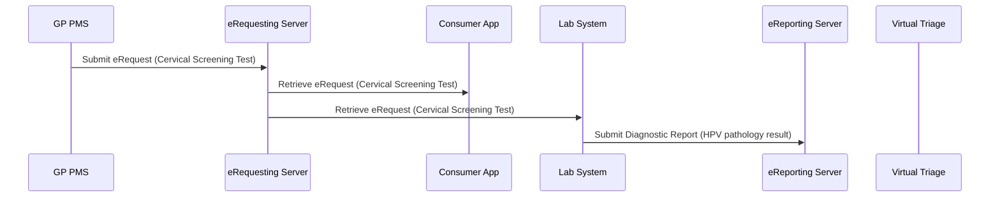
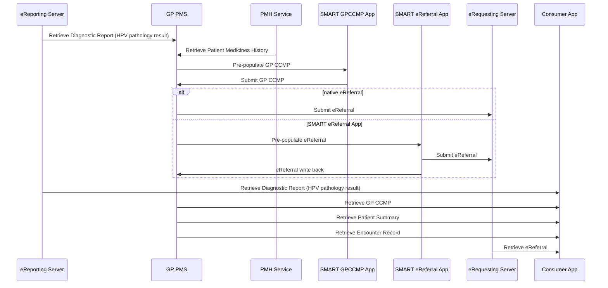
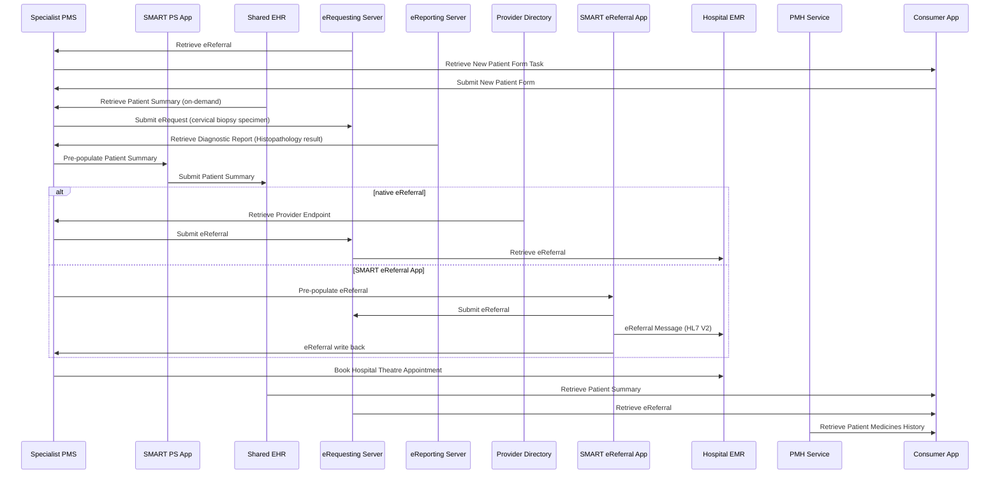
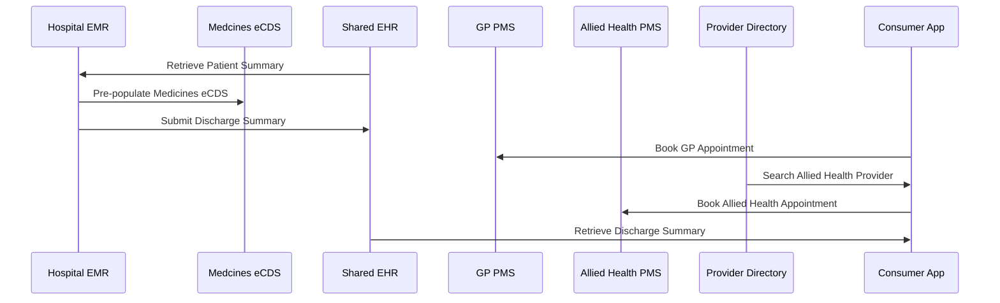
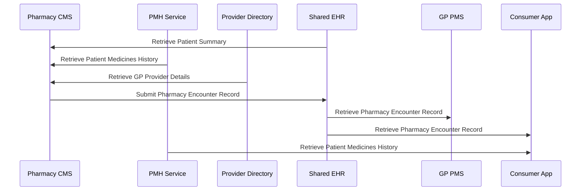
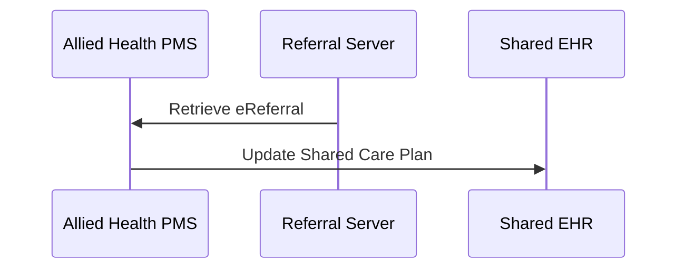
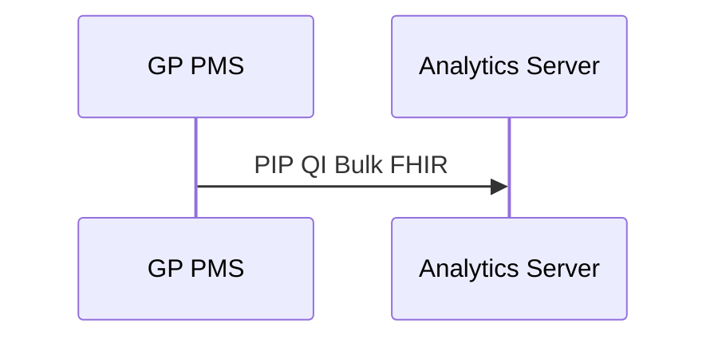

# Alex’s Story Interactions

## 1. Pathology (Collection Centre)

## 2. General Practice

## 3. Specialist (Gynaecological Oncologist – Private Practice)

## 4. Private Hospital (Theatre / Inpatient)

## 5. Pharmacy

## 6. Allied Health (Physiotherapy & Counselling)

## 7. Population Health / Analytics

