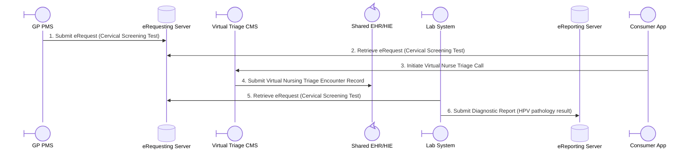
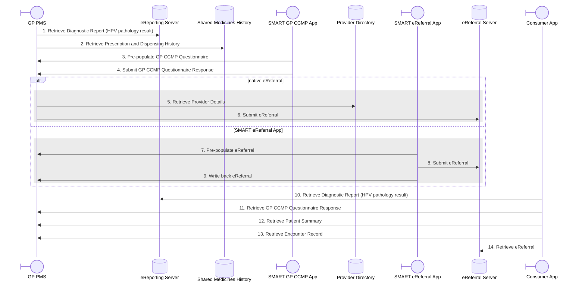
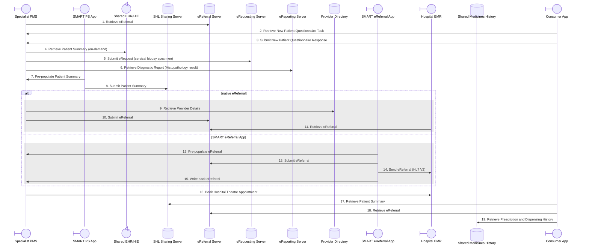
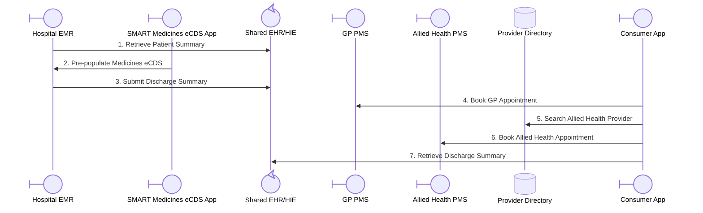
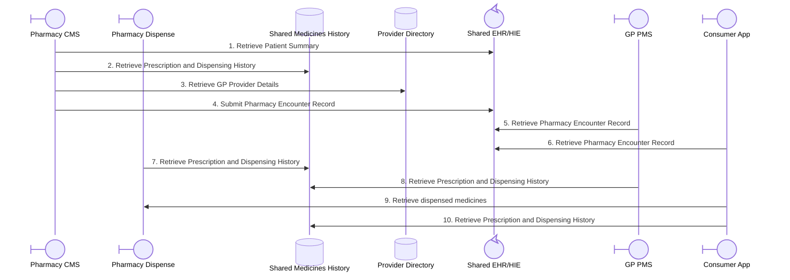
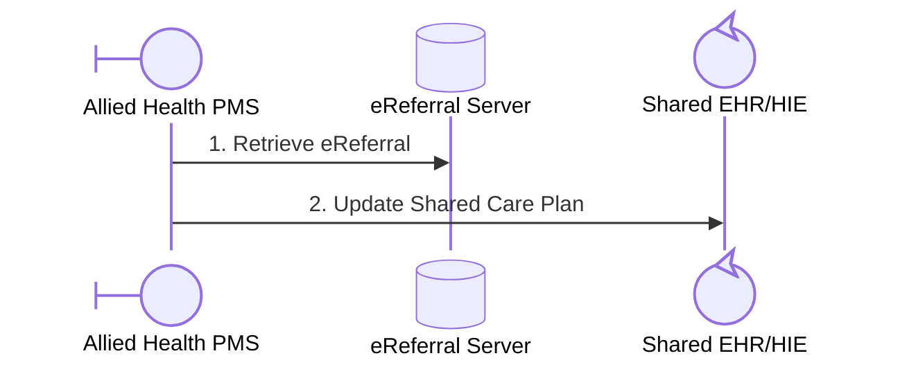
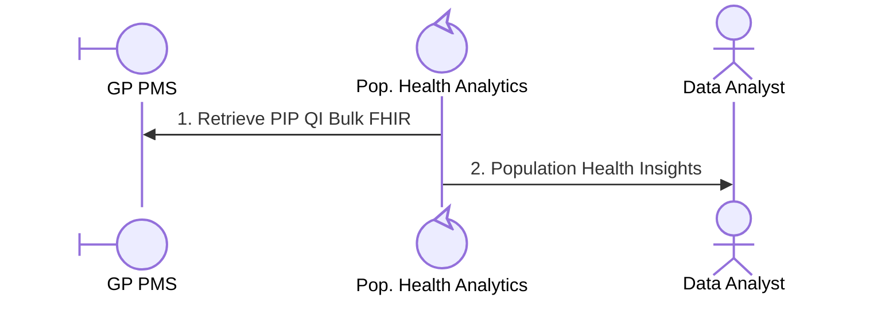

# Alex’s Story Interactions

This page describes Alex's Story as a sequence of possible system interactions, one sequence diagram per point of care from [Alex Story Data Set.md](Alex%20Story%20Data%20Set.md). Each diagram's participants are system roles; the Test Data File links tie individual interactions back to the sample FHIR resources provided in the test data set.

Each sequence diagram is followed by an Interaction Summary table; numbers in the diagram match the table's `#` column.

The diagram arrow points from the initiator to the responder.

Every participant appearing across the diagrams, whether it acts as a client (initiator), server (responder), or both, and a short description.

| Participant | Description | Client / Server |
| --- | --- | --- |
| Allied Health PMS | Allied Health Practice Management System | Client / Server |
| Pop. Health Analytics | Population Health Analytics Service | Client |
| Consumer App | Consumer-facing Personal Health App | Client |
| eReferral Server | Clinical eReferral Repository | Server |
| eReporting Server | Diagnostic Reporting Repository | Server |
| eRequesting Server | Diagnostic eRequesting Repository | Server |
| GP PMS | General Practice Practice Management System | Client / Server |
| Hospital EMR | Hospital Electronic Medical Record System | Client / Server |
| Lab System | Laboratory Information System | Client |
| SMART Medicines eCDS App | SMART Medicines Electronic Clinical Decision Support App | Client |
| Pharmacy CMS | Pharmacy Clinical Management System | Client |
| Pharmacy Dispense | Pharmacy Dispensing System | Client / Server |
| Provider Directory | Healthcare Provider Directory Repository | Server |
| SHL Sharing Server | SMART Health Link Sharing Server | Server |
| Shared EHR/HIE | Shared Health Information Exchange / Repository | Server |
| Shared Medicines History | Shared Medicines History Repository | Server |
| SMART eReferral App | SMART eReferral App | Client |
| SMART GP CCMP App | SMART GP Chronic Condition Management Plan App | Client |
| SMART PS App | SMART Patient Summary App | Client |
| Specialist PMS | Specialist Practice Management System | Client / Server |
| Virtual Triage CMS | Virtual Triage Clinical Management System | Client / Server |

## 1. Pathology (Collection Centre)

### Interaction Summary – Pathology (Collection Centre)

| # | Interaction | Initiator | Responder | Test Data File |
| --- | --- | --- | --- | --- |
| 1 | Submit eRequest (Cervical Screening Test) | GP PMS | eRequesting Server | [ServiceRequest-cervicalscreening-thompson-alex-20250930.json](ServiceRequest-cervicalscreening-thompson-alex-20250930.json) |
| 2 | Retrieve eRequest (Cervical Screening Test) | Consumer App | eRequesting Server | [ServiceRequest-cervicalscreening-thompson-alex-20250930.json](ServiceRequest-cervicalscreening-thompson-alex-20250930.json) |
| 3 | Initiate Virtual Nurse Triage Call | Consumer App | Virtual Triage CMS | _TBD_ |
| 4 | Submit Virtual Nursing Triage Encounter Record | Virtual Triage CMS | Shared EHR/HIE | _TBD_ |
| 5 | Retrieve eRequest (Cervical Screening Test) | Lab System | eRequesting Server | [ServiceRequest-cervicalscreening-thompson-alex-20250930.json](ServiceRequest-cervicalscreening-thompson-alex-20250930.json) |
| 6 | Submit Diagnostic Report (HPV pathology result) | Lab System | eReporting Server | [DiagnosticReport-hpvpathology-thompson-alex-20251008.json](DiagnosticReport-hpvpathology-thompson-alex-20251008.json) |

## 2. General Practice

### Interaction Summary – General Practice

| # | Interaction | Initiator | Responder | Test Data File |
| --- | --- | --- | --- | --- |
| 1 | Retrieve Diagnostic Report (HPV pathology result) | GP PMS | eReporting Server | [DiagnosticReport-hpvpathology-thompson-alex-20251008.json](DiagnosticReport-hpvpathology-thompson-alex-20251008.json) |
| 2 | Retrieve Prescription and Dispensing History | GP PMS | Shared Medicines History | *TBD — dispense record for Sertraline?* |
| 3 | Pre-populate GP CCMP Questionnaire | SMART GPCCMP App | GP PMS | *Various* |
| 4 | Submit GP CCMP Questionnaire Response | SMART GPCCMP App | GP PMS | _TBD — QuestionnaireResponse ?_|
| 5 | Retrieve Provider Details | GP PMS | Provider Directory | [PractitionerRole-obstetricianandgynaecologist-chen-emily.json](PractitionerRole-obstetricianandgynaecologist-chen-emily.json) |
| 6 | Submit eReferral | GP PMS | eReferral Server | [ServiceRequest-referral-gynaecologist-thompson-alex-20251009.json](ServiceRequest-referral-gynaecologist-thompson-alex-20251009.json) |
| 7 | Pre-populate eReferral | SMART eReferral App | GP PMS | *Various* |
| 8 | Submit eReferral | SMART eReferral App | eReferral Server | [ServiceRequest-referral-gynaecologist-thompson-alex-20251009.json](ServiceRequest-referral-gynaecologist-thompson-alex-20251009.json) |
| 9 | Write back eReferral | SMART eReferral App | GP PMS | [ServiceRequest-referral-gynaecologist-thompson-alex-20251009.json](ServiceRequest-referral-gynaecologist-thompson-alex-20251009.json) |
| 10 | Retrieve Diagnostic Report (HPV pathology result) | Consumer App | eReporting Server | [DiagnosticReport-hpvpathology-thompson-alex-20251008.json](DiagnosticReport-hpvpathology-thompson-alex-20251008.json) |
| 11 | Retrieve GP CCMP Questionnaire Response | Consumer App | GP PMS | _TBD — QuestionnaireResponse ?_|
| 12 | Retrieve Patient Summary | Consumer App | GP PMS | [Bundle-aups-thompson-alex-20251009.json](Bundle-aups-thompson-alex-20251009.json) |
| 13 | Retrieve Encounter Record | Consumer App | GP PMS | [Composition-episodeofcaresummary-thompson-alex-20251009.json](Composition-episodeofcaresummary-thompson-alex-20251009.json) |
| 14 | Retrieve eReferral | Consumer App | eReferral Server | [ServiceRequest-referral-gynaecologist-thompson-alex-20251009.json](ServiceRequest-referral-gynaecologist-thompson-alex-20251009.json) |

## 3. Specialist (Gynaecological Oncologist – Private Practice)

### Interaction Summary – Specialist (Gynaecological Oncologist – Private Practice)

| # | Interaction | Initiator | Responder | Test Data File |
| --- | --- | --- | --- | --- |
| 1 | Retrieve eReferral | Specialist PMS | eReferral Server | [ServiceRequest-referral-gynaecologist-thompson-alex-20251009.json](ServiceRequest-referral-gynaecologist-thompson-alex-20251009.json) |
| 2 | Retrieve New Patient Questionnaire Task | Consumer App | Specialist PMS | _TBD_ |
| 3 | Submit New Patient Questionnaire Response | Consumer App | Specialist PMS | _TBD_ |
| 4 | Retrieve Patient Summary (on-demand) | Specialist PMS | Shared EHR/HIE | [Bundle-aups-thompson-alex-20251009.json](Bundle-aups-thompson-alex-20251009.json) |
| 5 | Submit eRequest (cervical biopsy specimen) | Specialist PMS | eRequesting Server | [ServiceRequest-histopathology-thompson-alex-20251015.json](ServiceRequest-histopathology-thompson-alex-20251015.json) |
| 6 | Retrieve Diagnostic Report (Histopathology result) | Specialist PMS | eReporting Server | [DiagnosticReport-histopathology-thompson-alex-20251020.json](DiagnosticReport-histopathology-thompson-alex-20251020.json) |
| 7 | Pre-populate Patient Summary | SMART PS App | Specialist PMS | *Various* |
| 8 | Submit Patient Summary | SMART PS App | SHL Sharing Server | [Bundle-aups-specialist-thompson-alex-20251101.json](Bundle-aups-specialist-thompson-alex-20251101.json) |
| 9 | Retrieve Provider Details | Specialist PMS | Provider Directory | [PractitionerRole-surgeon-wilson-mark.json](PractitionerRole-surgeon-wilson-mark.json) |
| 10 | Submit eReferral | Specialist PMS | eReferral Server | [ServiceRequest-conebiopsydaysurgery-thompson-alex-20251020.json](ServiceRequest-conebiopsydaysurgery-thompson-alex-20251020.json) |
| 11 | Retrieve eReferral | Hospital EMR | eReferral Server | [ServiceRequest-conebiopsydaysurgery-thompson-alex-20251020.json](ServiceRequest-conebiopsydaysurgery-thompson-alex-20251020.json) |
| 12 | Pre-populate eReferral | SMART eReferral App | Specialist PMS | *Various* |
| 13 | Submit eReferral | SMART eReferral App | eReferral Server | [ServiceRequest-conebiopsydaysurgery-thompson-alex-20251020.json](ServiceRequest-conebiopsydaysurgery-thompson-alex-20251020.json) |
| 14 | Send eReferral (HL7 V2) | SMART eReferral App | Hospital EMR | _TBD_|
| 15 | Write back eReferral  | SMART eReferral App | Specialist PMS | [ServiceRequest-conebiopsydaysurgery-thompson-alex-20251020.json](ServiceRequest-conebiopsydaysurgery-thompson-alex-20251020.json) |
| 16 | Book Hospital Theatre Appointment | Specialist PMS | Hospital EMR | [Appointment-hospitalbooking-thompson-alex-20251101.json](Appointment-hospitalbooking-thompson-alex-20251101.json) |
| 17 | Retrieve Patient Summary | Consumer App | SHL Sharing Server | [Bundle-aups-specialist-thompson-alex-20251101.json](Bundle-aups-specialist-thompson-alex-20251101.json) |
| 18 | Retrieve eReferral | Consumer App | eReferral Server | [ServiceRequest-conebiopsydaysurgery-thompson-alex-20251020.json](ServiceRequest-conebiopsydaysurgery-thompson-alex-20251020.json) |
| 19 | Retrieve Prescription and Dispensing History | Consumer App | Shared Medicines History | [MedicationRequest-ibuprofen-thompson-alex-20251015.json](MedicationRequest-ibuprofen-thompson-alex-20251015.json) [MedicationRequest-paracetamol-thompson-alex-20251015.json](MedicationRequest-paracetamol-thompson-alex-20251015.json) |

## 4. Private Hospital (Theatre / Inpatient)

### Interaction Summary – Private Hospital (Theatre / Inpatient)

| # | Interaction | Initiator | Responder | Test Data File |
| --- | --- | --- | --- | --- |
| 1 | Retrieve Patient Summary | Hospital EMR | Shared EHR/HIE | _TBD_|
| 2 | Pre-populate Medicines eCDS | SMART Medicines eCDS App | Hospital EMR | *Various* |
| 3 | Submit Discharge Summary | Hospital EMR | Shared EHR/HIE | [DocumentReference-dischargesummary-thompson-alex-20251101.json](DocumentReference-dischargesummary-thompson-alex-20251101.json) |
| 4 | Book GP Appointment | Consumer App | GP PMS | [Appointment-followupgp-thompson-alex-20251108.json](Appointment-followupgp-thompson-alex-20251108.json) |
| 5 | Search Allied Health Provider | Consumer App | Provider Directory | [PractitionerRole-physiotherapist-evans-sarah.json](PractitionerRole-physiotherapist-evans-sarah.json) [PractitionerRole-counsellorsnec-patel-rachel.json](PractitionerRole-counsellorsnec-patel-rachel.json) |
| 6 | Book Allied Health Appointment | Consumer App | Allied Health PMS | [Appointment-followupphysio-thompson-alex-20251110.json](Appointment-followupphysio-thompson-alex-20251110.json) [Appointment-followupcounselling-thompson-alex-20251115.json](Appointment-followupcounselling-thompson-alex-20251115.json) |
| 7 | Retrieve Discharge Summary | Consumer App | Shared EHR/HIE | [DocumentReference-dischargesummary-thompson-alex-20251101.json](DocumentReference-dischargesummary-thompson-alex-20251101.json) |

## 5. Pharmacy

### Interaction Summary – Pharmacy

| # | Interaction | Initiator | Responder | Test Data File |
| --- | --- | --- | --- | --- |
| 1 | Retrieve Patient Summary | Pharmacy CMS | Shared EHR/HIE | _TBD_ |
| 2 | Retrieve Prescription and Dispensing History | Pharmacy CMS | Shared Medicines History | [MedicationRequest-ibuprofen-discharge-thompson-alex-20251101.json](MedicationRequest-ibuprofen-discharge-thompson-alex-20251101.json) [MedicationRequest-paracetamol-discharge-thompson-alex-20251101.json](MedicationRequest-paracetamol-discharge-thompson-alex-20251101.json) |
| 3 | Retrieve GP Provider Details | Pharmacy CMS | Provider Directory | [PractitionerRole-generalpractitioner-smith-jane.json](PractitionerRole-generalpractitioner-smith-jane.json) |
| 4 | Submit Pharmacy Encounter Record | Pharmacy CMS | Shared EHR/HIE | [Composition-medicationreview-thompson-alex-20251102.json](Composition-medicationreview-thompson-alex-20251102.json) |
| 5 | Retrieve Pharmacy Encounter Record | GP PMS | Shared EHR/HIE | [Composition-medicationreview-thompson-alex-20251102.json](Composition-medicationreview-thompson-alex-20251102.json) |
| 6 | Retrieve Pharmacy Encounter Record | Consumer App | Shared EHR/HIE | [Composition-medicationreview-thompson-alex-20251102.json](Composition-medicationreview-thompson-alex-20251102.json) |
| 7 | Retrieve Prescription and Dispensing History | Pharmacy Dispense | Shared Medicines History | [MedicationRequest-ibuprofen-discharge-thompson-alex-20251101.json](MedicationRequest-ibuprofen-discharge-thompson-alex-20251101.json) [MedicationRequest-paracetamol-discharge-thompson-alex-20251101.json](MedicationRequest-paracetamol-discharge-thompson-alex-20251101.json) |
| 8 | Retrieve Prescription and Dispensing History | GP PMS | Shared Medicines History | [MedicationStatement-sertraline-thompson-alex-20251102.json](MedicationStatement-sertraline-thompson-alex-20251102.json) [MedicationStatement-ibuprofen-postdischarge-thompson-alex-20251102.json](MedicationStatement-ibuprofen-postdischarge-thompson-alex-20251102.json) [MedicationStatement-paracetamol-postdischarge-thompson-alex-20251102.json](MedicationStatement-paracetamol-postdischarge-thompson-alex-20251102.json) [MedicationStatement-oxycodone-thompson-alex-20251102.json](MedicationStatement-oxycodone-thompson-alex-20251102.json) |
| 9 | Retrieve dispensed medicines | Consumer App | Pharmacy Dispense | [MedicationDispense-ibuprofen-thompson-alex-20251102.json](MedicationDispense-ibuprofen-thompson-alex-20251102.json) [MedicationDispense-oxycodone-thompson-alex-20251102.json](MedicationDispense-oxycodone-thompson-alex-20251102.json) [MedicationDispense-paracetamol-thompson-alex-20251102.json](MedicationDispense-paracetamol-thompson-alex-20251102.json) |
| 10 | Retrieve Prescription and Dispensing History | Consumer App | Shared Medicines History | [MedicationStatement-sertraline-thompson-alex-20251102.json](MedicationStatement-sertraline-thompson-alex-20251102.json) [MedicationStatement-ibuprofen-postdischarge-thompson-alex-20251102.json](MedicationStatement-ibuprofen-postdischarge-thompson-alex-20251102.json) [MedicationStatement-paracetamol-postdischarge-thompson-alex-20251102.json](MedicationStatement-paracetamol-postdischarge-thompson-alex-20251102.json) [MedicationStatement-oxycodone-thompson-alex-20251102.json](MedicationStatement-oxycodone-thompson-alex-20251102.json) |

## 6. Allied Health (Physiotherapy & Counselling)

### Interaction Summary – Allied Health (Physiotherapy & Counselling)

| # | Interaction | Initiator | Responder | Test Data File |
| --- | --- | --- | --- | --- |
| 1 | Retrieve eReferral | Allied Health PMS | eReferral Server | [ServiceRequest-referral-physio-thompson-alex-20251101.json](ServiceRequest-referral-physio-thompson-alex-20251101.json) [ServiceRequest-referral-counselling-thompson-alex-20251101.json](ServiceRequest-referral-counselling-thompson-alex-20251101.json) |
| 2 | Update Shared Care Plan | Allied Health PMS | Shared EHR/HIE | _TBD_ |

## 7. Population Health / Analytics

### Interaction Summary – Population Health / Analytics

| # | Interaction | Initiator | Responder | Test Data File |
| --- | --- | --- | --- | --- |
| 1 | Retrieve PIP QI Bulk FHIR | Pop. Health Analytics | GP PMS | _TBD_ |
| 2 | Population Health Insights | Pop. Health Analytics | Data Analyst | _N/A_|
