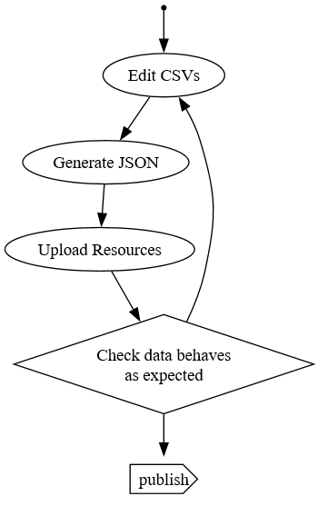

# Development Process

The development process is as described here:

There are two command line utilities to generate the FHIR JSON files and upload the generated test data to a FHIR Server. They are being developed in [`hl7au / au-fhir-test-data`](https://github.com/hl7au/au-fhir-test-data) to [`hl7au / au-fhir-test-data-utils`](https://github.com/hl7au/au-fhir-test-data-utils).

* Csv2FhirMapping maps CSV files to FHIR resource in JSON syntax. 
* TestDataClient uploads resource to a server. 

Both utilities require to open a Command Prompt `cmd` ([advice](https://www.digitalcitizen.life/open-cmd/)) and are driven by windows command files, as shown below.

## Generate data (`Csv2FhirMapping`)

### Specific

To generate a specific resource type, type `GenerateData.bat ` followed by an output directory and resource type.

Usage: ` GenerateData.bat output-folder resource-type `

Example with local directory `generated` and resource type `Patient`: ` GenerateData.bat generated Patient `

### All

To generate all resource types, type `GenerateAll.bat `.

Usage: ` GenerateAll.bat `

## Upload Data

The FHIR server request's Authorization header is generated using the `auth-scheme` and `auth-parameter` arguments in the calls below.

### Upload specific data

To upload a specific resource type, type `UploadData.bat `. 

Usage: ` UploadData.bat fhir-server auth-scheme auth-parameter input-folder resource-type `

Example: ` UploadData.bat https://fhir.hl7.org.au/aucore/fhir/DEFAULT Basic {{base64-encouded-userid:password}} generated Patient `

### Upload all generated eRequesting data

To all eRequesting resource types, type `UploadERequesting.bat `.

Usage: ` UploadERequesting.bat fhir-server auth-scheme auth-parameter `

Example: ` UploadERequesting.bat https://fhir.hl7.org.au/aucore/fhir/DEFAULT Basic {{base64-encouded-userid:password}} `

### Upload all generated data

To upload all resource types, type `UploadGenerated.bat `.

Usage: ` UploadGenerated.bat fhir-server auth-scheme auth-parameter `

Example: ` UploadGenerated.bat https://fhir.hl7.org.au/aucore/fhir/DEFAULT Basic {{base64-encouded-userid:password}} `